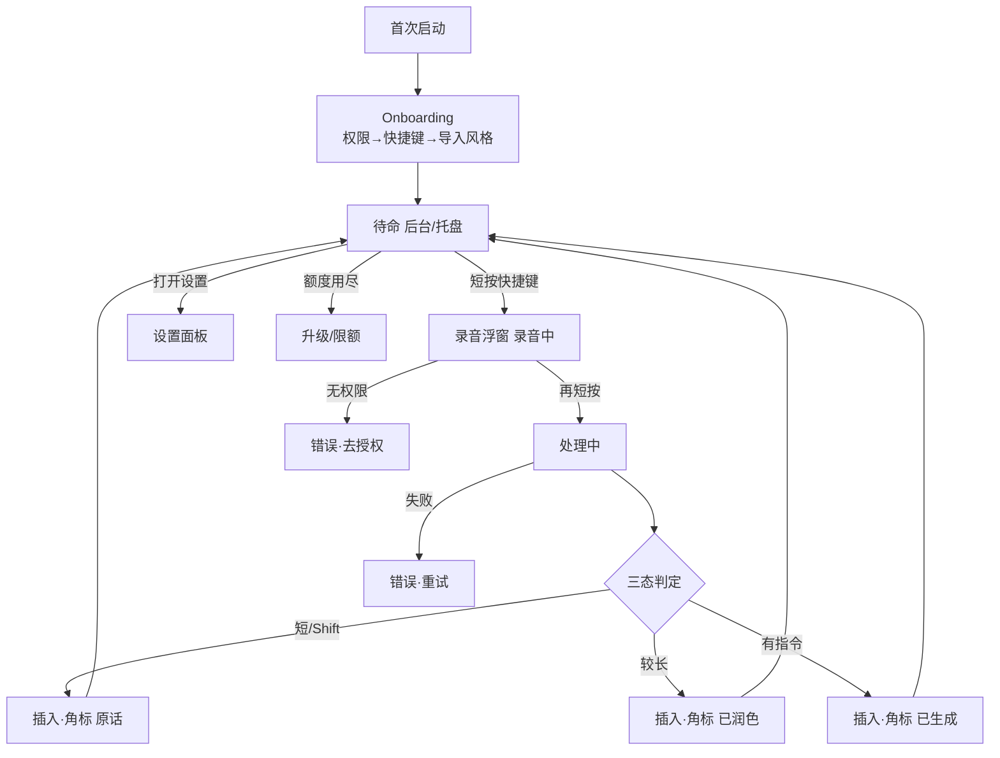
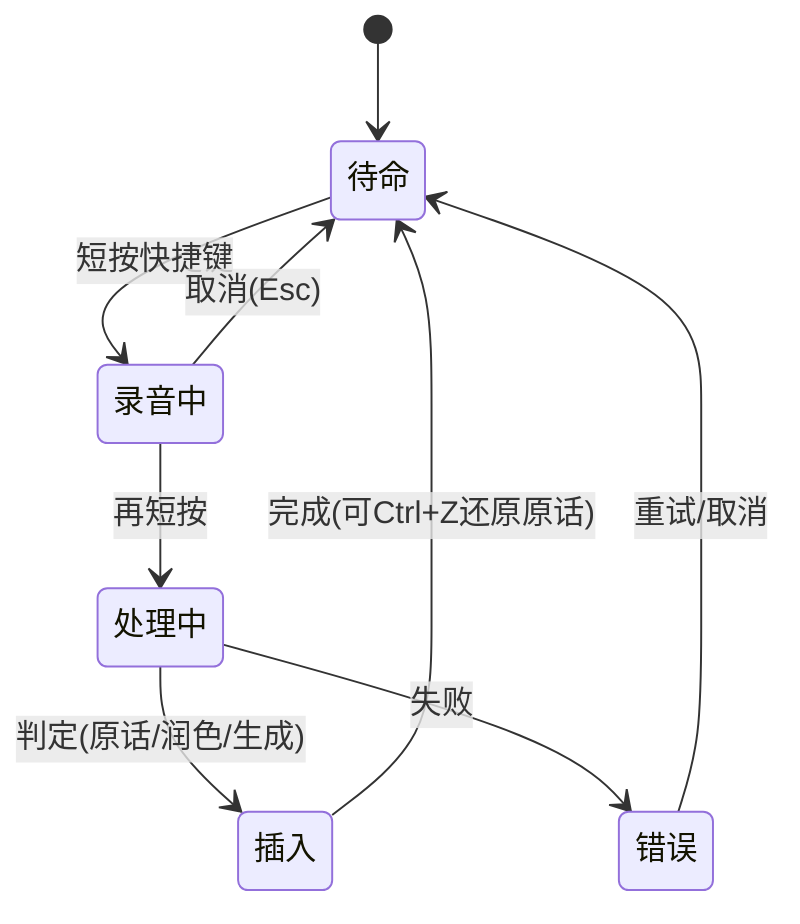

# 界面规格（线框）：sayit V1（PC 端）

> 承接 ④ PRD（09）。低保真，重布局/流程/状态/交互。可点击原型见 `11-Prototype-sayit.html`。

## 1. 屏幕流

## 2. 状态机（核心：一次语音输入）

## 3. 每屏规格

### 屏 S1：Onboarding ← PRD F1/F4/F7
- 元素：步骤条(权限/快捷键/导入)、麦克风授权按钮、快捷键录制框、"导入历史文本"上传区、跳过。
- 状态：默认 / 导入空(未传) / 授权被拒(提示去系统设置)。
- 交互：授权→系统弹窗；录快捷键→按键捕获；导入 3-5 段→生成初版风格→完成进待命。

### 屏 S2：录音浮窗（录音中）← PRD F1/F2
- 元素：屏幕一角浮窗、声波动效、**实时转写文本**、"再按结束"提示、Esc 取消。
- 状态：默认(录音中) / **无权限(错误：去授权)** / 断网(若云 ASR：提示)。
- 交互：再短按→处理中；Esc→取消回待命；长内容滚动显示。

### 屏 S3：处理中 ← PRD F3
- 元素：浮窗内 loading(转写→判定→生成)。
- 状态：处理中(loading) / **失败(错误：重试/取消)**。
- 交互：完成→插入；时长 <3s（生成态）。

### 屏 S4：插入 + 角标 ← PRD F3/F5
- 元素：结果**直接插入当前输入框**；光标旁/浮窗角标显示态。
- 状态：**原话** / **已润色** / **已生成**（三态角标，~1s 淡出）。
- 交互：Ctrl+Z→还原原话；插入失败→回退剪贴板+提示粘贴。

### 屏 S5：设置面板 ← PRD F9
- 元素：快捷键自定义、润色阈值(默认50)、润色开关、强制原话修饰键、账户/订阅、用量(本周字数)。
- 状态：默认 / 免费(显额度) / Pro(不限量)。
- 交互：改即存；点订阅→升级。

### 屏 S6：升级/限额 ← PRD F8
- 元素：本周额度用尽提示、Pro 权益(不限量+个性化深度)、价格(¥/月)、升级按钮。
- 状态：默认(超限触发) / 升级中。
- 交互：升级→支付；关闭→仅原话可继续(基础)。

## 4. 全局组件与规范
- **角标组件**：原话(灰)/已润色(蓝)/已生成(紫)，统一样式、~1s 淡出。
- **快捷键总表**：唤起=自定义；再按=确定插入；Esc=取消；Shift+确定=强制原话；Ctrl+Z=还原。
- **反馈规范**：所有 AI 处理都给可视态 + 可撤销，绝不静默改写。

## 5. 交接说明
- 待补：浮窗具体尺寸/位置随光标的策略；高保真视觉(配色/图标)为后续视觉设计。
- 风险红队点：角标会不会太干扰?→ 可在设置关；插入失败的回退路径需研发确认各 App 兼容性。
